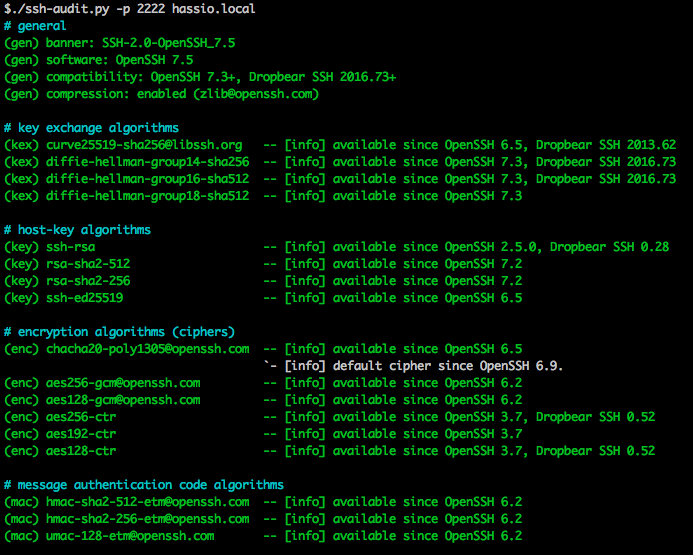

# Hass.io Add-on: SSH - Secure Shell

![Project Stage][project-stage-shield]
![Maintenance][maintenance-shield]
![Awesome][awesome-shield]
[![License][license-shield]](LICENSE.md)

This add-on allows you to log in to your Hass.io Home Assistant instance using
SSH. Giving you to access your Hass.io folders and also includes a
command-line tool to do things like restart, update, and check your instance.

This is an enhanced version of the provided 
[SSH add-on by Home Assistant][hass-ssh] and focusses on security,
usability and flexibility.

## Docker status

[![Docker Architecture][armhf-arch-shield]][armhf-dockerhub]
[![Docker Version][armhf-version-shield]][armhf-microbadger]
[![Docker Layers][armhf-layers-shield]][armhf-microbadger]
[![Docker Pulls][armhf-pulls-shield]][armhf-dockerhub]

[![Docker Architecture][aarch64-arch-shield]][aarch64-dockerhub]
[![Docker Version][aarch64-version-shield]][aarch64-microbadger]
[![Docker Layers][aarch64-layers-shield]][aarch64-microbadger]
[![Docker Pulls][aarch64-pulls-shield]][aarch64-dockerhub]

[![Docker Architecture][amd64-arch-shield]][amd64-dockerhub]
[![Docker Version][amd64-version-shield]][amd64-microbadger]
[![Docker Layers][amd64-layers-shield]][amd64-microbadger]
[![Docker Pulls][amd64-pulls-shield]][amd64-dockerhub]

[![Docker Architecture][i386-arch-shield]][i386-dockerhub]
[![Docker Version][i386-version-shield]][i386-microbadger]
[![Docker Layers][i386-layers-shield]][i386-microbadger]
[![Docker Pulls][i386-pulls-shield]][i386-dockerhub]

## Features

This add-on, of course, provides an SSH server, based on [OpenSSH][openssh].
Additionally, it comes out of the box with the following:

- A secure default configuration of SSH:
  - Only allows login by the configured user, even if more users are created.
  - Only uses known secure ciphers and algorithms.
  - Limits login attempts to hold of brute-force attacks better.
  - Many more security tweaks, *this addon passes all [ssh-audit] checks
    without warnings!*
    
- Port number is configurable (You could use `1982` instead of port `22`).
- SFTP support is disabled by default but is user configurable.
- Username is configurable, so `root` is no longer mandatory.
- Debug mode for allowing you to triage issues easier.
- Compatible if Hass.io was installed via the generic Linux installer.
- Have Alpine packages installed on start. This will allow you to install your
favorite tools, which will be available every single time you log in.
- Execute custom commands on start automatically, so you can customize the shell
to your likings.
- [ZSH][zsh] as its default shell. Easier to use for the beginner, more advanced
for the more experienced user. It even comes preloaded with 
["Oh My ZSH"][ohmyzsh], with some plugins enabled as well.
- Contains a sensible set of tools right out of the box: curl, Wget, RSync, GIT,
Nmap, Mosquitto client, MariaDB/MySQL client, Awake (“wake on lan”), Nano, Vim,
tmux, and a bunch commonly used networking tools.

## Installation

The installation of this add-on is pretty straight forward and not different in
comparison to installing any other Hass.io add-on.

1. If you installed the "SSH server" add-on from the built-in add-on, then
that one first.
2. [Add our Hass.io add-ons repository][repository] to your Hass.io instance
3. Install the "SSH - Secure Shell" add-on from our repository
3. Start the "SSH - Secure Shell" add-on
4. Check the logs of the "SSH - Secure Shell" add-on to see if everything
went well.

Please read the rest of this document further instructions.

## Configuration

_Please remember to restart the add-on when the configuration changes._

Example add-on configuration:
```json
{
  "debug": true,
  "port": 22,
  "username": "hass",
  "password": "",
  "authorized_keys": [
    "ssh-rsa AASDJKJKJFWJFAFLCNALCMLAK234234....."
  ],
  "sftp": false,
  "packages": [
    "python",
    "python-dev",
    "py-pip",
    "build-base"
  ],
  "init_commands": [
    "pip install virtualenv",
    "pip install yamllint"
  ]
}
```
_*Note*: This is just an example, don't copy and past it! Create your own!_

**Option: `debug`**

When set to `true` the addon will output more information in the logs of the
add-on. The add-on will also start the SSH daemon in debug mode. While SSH is
running in daemon mode, it will be only able to accept one single connection. As
soon as this session is ended, the addon will stop running.

This might be useful when you're dealing with an unknown issue. It is
recommended leaving to option set to `false`, unless you are troubleshooting.

**Option: `port`**

The default port for SSH is `22`, some security guides actually recommend to
change the port to something else. Sometimes you'd just like to have it on
another port. Remember, if you change to port, be sure it is not in use 
already!

**Option: `username`**

This option allows you to change to username the use when you log in via SSH.
It is only used for the authentication, you will be the `root` user after
you have authenticated. Using `root` as the username is possible, but not
recommended.

_*Note*: Due to limitations, you will need to set this option to `root` in
order to be able to enable the SFTP capabilities._

**Option: `password`**

Sets the password to log in with. Leaving it empty would disable the posibility
to authenticate with a password. We would highly recommend not to use this
option from a security point of view.

**Option: `authorized_keys`**

Add one or more public keys to your SSH server to use with authentication.
This is the recommended over setting a password.

Please take a look at the awesome [documentation created by GitHub][github-ssh]
about using public/private keypairs and how to create them.

**Option: `sftp`**

When set to `true` the addon will enable SFTP support on the SSH daemon.
Please only enable it when you plan to use it.

_*Note*: Due to limitations, you will need to set the username to `root` in
order to be able to enable the SFTP capabilities._

**Option: `packages`**

Allows you to specify additional [Alpine packages][alpine-packages] to be 
installed in your shell environment (e.g. Python, Joe, Irssi).

_*Note*: Adding many packages will result in a longer start-up 
time for the add-on._

**Option: `init_commands`**

Customize your shell environment even more with the `init_commands` option.
Add one or more shell commands to the list, and they will be executed every
single time this add-on starts. 

## Known issues and limitations

- When SFTP is enabled, the username MUST be set to `root`. 

## Support

Got questions? Got some unexpected behavior caused by this plugin?

Please [open an issue on our GitHub repository][issues] and we'll do our best
to help you out.

## Credits

A big shout out to the following people, without them this add-on wasn't possible:
- The team & community of [Home Assistant][home-assistant] for developing such an
excellent home automation toolkit

Thank you all!

## More Hass.io add-ons

Do you like this add-on? Want some more functionality to your Hass.io Home
Assistant instance?

We've created multiple add-ons for Hass.io. For a full list, check out
our [GitHub Repository][repository].

## License

MIT License

Copyright (c) 2017 Franck Nijhof

Permission is hereby granted, free of charge, to any person obtaining a copy
of this software and associated documentation files (the "Software"), to deal
in the Software without restriction, including without limitation the rights
to use, copy, modify, merge, publish, distribute, sublicense, and/or sell
copies of the Software, and to permit persons to whom the Software is
furnished to do so, subject to the following conditions:

The above copyright notice and this permission notice shall be included in all
copies or substantial portions of the Software.

THE SOFTWARE IS PROVIDED "AS IS", WITHOUT WARRANTY OF ANY KIND, EXPRESS OR
IMPLIED, INCLUDING BUT NOT LIMITED TO THE WARRANTIES OF MERCHANTABILITY,
FITNESS FOR A PARTICULAR PURPOSE AND NONINFRINGEMENT. IN NO EVENT SHALL THE
AUTHORS OR COPYRIGHT HOLDERS BE LIABLE FOR ANY CLAIM, DAMAGES OR OTHER
LIABILITY, WHETHER IN AN ACTION OF CONTRACT, TORT OR OTHERWISE, ARISING FROM,
OUT OF OR IN CONNECTION WITH THE SOFTWARE OR THE USE OR OTHER DEALINGS IN THE
SOFTWARE.

[aarch64-arch-shield]: https://img.shields.io/badge/architecture-aarch64-blue.svg
[aarch64-dockerhub]: https://hub.docker.com/r/hassioaddons/ssh-aarch64
[aarch64-layers-shield]: https://images.microbadger.com/badges/image/hassioaddons/ssh-aarch64.svg
[aarch64-microbadger]: https://microbadger.com/images/hassioaddons/ssh-aarch64
[aarch64-pulls-shield]: https://img.shields.io/docker/pulls/hassioaddons/ssh-aarch64.svg
[aarch64-version-shield]: https://images.microbadger.com/badges/version/hassioaddons/ssh-aarch64.svg
[alpine-packages]: https://pkgs.alpinelinux.org/packages
[amd64-arch-shield]: https://img.shields.io/badge/architecture-amd64-blue.svg
[amd64-dockerhub]: https://hub.docker.com/r/hassioaddons/ssh-amd64
[amd64-layers-shield]: https://images.microbadger.com/badges/image/hassioaddons/ssh-amd64.svg
[amd64-microbadger]: https://microbadger.com/images/hassioaddons/ssh-amd64
[amd64-pulls-shield]: https://img.shields.io/docker/pulls/hassioaddons/ssh-amd64.svg
[amd64-version-shield]: https://images.microbadger.com/badges/version/hassioaddons/ssh-amd64.svg
[armhf-arch-shield]: https://img.shields.io/badge/architecture-armhf-blue.svg
[armhf-dockerhub]: https://hub.docker.com/r/hassioaddons/ssh-armhf
[armhf-layers-shield]: https://images.microbadger.com/badges/image/hassioaddons/ssh-armhf.svg
[armhf-microbadger]: https://microbadger.com/images/hassioaddons/ssh-armhf
[armhf-pulls-shield]: https://img.shields.io/docker/pulls/hassioaddons/ssh-armhf.svg
[armhf-version-shield]: https://images.microbadger.com/badges/version/hassioaddons/ssh-armhf.svg
[awesome-shield]: https://img.shields.io/badge/awesome%3F-yes-brightgreen.svg
[github-ssh]: https://help.github.com/articles/connecting-to-github-with-ssh/
[hass-ssh]: https://home-assistant.io/addons/ssh/
[home-assistant]: https://home-assistant.io
[i386-arch-shield]: https://img.shields.io/badge/architecture-i386-blue.svg
[i386-dockerhub]: https://hub.docker.com/r/hassioaddons/ssh-i386
[i386-layers-shield]: https://images.microbadger.com/badges/image/hassioaddons/ssh-i386.svg
[i386-microbadger]: https://microbadger.com/images/hassioaddons/ssh-i386
[i386-pulls-shield]: https://img.shields.io/docker/pulls/hassioaddons/ssh-i386.svg
[i386-version-shield]: https://images.microbadger.com/badges/version/hassioaddons/ssh-i386.svg
[issues]: https://github.com/hassio-addons/repository/issues
[license-shield]: https://img.shields.io/github/license/hassio-addons/repository.svg
[maintenance-shield]: https://img.shields.io/maintenance/yes/2017.svg
[ohmyzsh]: http://ohmyz.sh/
[openssh]: https://www.openssh.com/
[project-stage-shield]: https://img.shields.io/badge/Project%20Stage-Development-yellowgreen.svg
[repository]: https://github.com/hassio-addons/repository
[ssh-audit]: https://github.com/arthepsy/ssh-audit
[zsh]: https://en.wikipedia.org/wiki/Z_shell