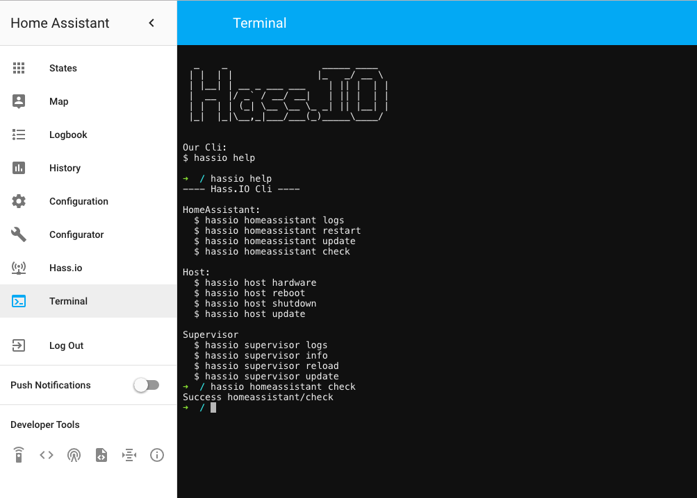

# Hass.io Add-on: Terminal

![Project Stage][project-stage-shield]
![Maintenance][maintenance-shield]
![Awesome][awesome-shield]
[![License][license-shield]](LICENSE.md)

This add-on allows you to log in to your Hass.io Home Assistant instance using
a web terminal. Giving you to access your Hass.io folders and also includes a
command-line tool to do things like restart, update, and check your instance.



## Docker status

[![Docker Architecture][armhf-arch-shield]][armhf-dockerhub]
[![Docker Version][armhf-version-shield]][armhf-microbadger]
[![Docker Layers][armhf-layers-shield]][armhf-microbadger]
[![Docker Pulls][armhf-pulls-shield]][armhf-dockerhub]

[![Docker Architecture][aarch64-arch-shield]][aarch64-dockerhub]
[![Docker Version][aarch64-version-shield]][aarch64-microbadger]
[![Docker Layers][aarch64-layers-shield]][aarch64-microbadger]
[![Docker Pulls][aarch64-pulls-shield]][aarch64-dockerhub]

[![Docker Architecture][amd64-arch-shield]][amd64-dockerhub]
[![Docker Version][amd64-version-shield]][amd64-microbadger]
[![Docker Layers][amd64-layers-shield]][amd64-microbadger]
[![Docker Pulls][amd64-pulls-shield]][amd64-dockerhub]

[![Docker Architecture][i386-arch-shield]][i386-dockerhub]
[![Docker Version][i386-version-shield]][i386-microbadger]
[![Docker Layers][i386-layers-shield]][i386-microbadger]
[![Docker Pulls][i386-pulls-shield]][i386-dockerhub]

## Features

- Access your terminal right from the web!
- Add-able to your Home Assistant interface.
- Debug mode for allowing you to triage issues easier.
- Compatible if Hass.io was installed via the generic Linux installer.
- Have Alpine packages installed on start. This will allow you to install your
favorite tools, which will be available every single time you log in.
- Execute custom commands on start automatically, so you can customize the shell
to your likings.
- [ZSH][zsh] as its default shell. Easier to use for the beginner, more advanced
for the more experienced user. It even comes preloaded with 
["Oh My ZSH"][ohmyzsh], with some plugins enabled as well.
- Contains a sensible set of tools right out of the box: curl, Wget, RSync, GIT,
Nmap, Mosquitto client, MariaDB/MySQL client, Awake (“wake on lan”), Nano, Vim,
tmux, and a bunch commonly used networking tools.

## Installation

The installation of this add-on is pretty straight forward and not different in
comparison to installing any other Hass.io add-on.

1. [Add our Hass.io add-ons repository][repository] to your Hass.io instance
2. Install the "Terminal" add-on from our repository
3. Start the "Terminal" add-on
4. Check the logs of the "Terminal" add-on to see if everything
went well.
5. Surf to your Hass.io instance and use port `7681` (e.g. 
`http://hassio.local:7681`).

Please read the rest of this document further instructions.

## Configuration

_Please remember to restart the add-on when the configuration changes._

Example add-on configuration:
```json
{
  "debug": false,
  "username": "hass",
  "password": "changeme",
  "ssl": true,
  "certfile": "fullchain.pem",
  "keyfile": "privkey.pem",
  "packages": [
    "python",
    "python-dev",
    "py-pip",
    "build-base"
  ],
  "init_commands": [
    "pip install virtualenv",
    "pip install yamllint"
  ]
}
```
_*Note*: This is just an example, don't copy and past it! Create your own!_

**Option: `debug`**

When set to `true` the addon will output more information in the logs of the
add-on. The add-on will also start the terminal server in debug mode.

This might be useful when you're dealing with an unknown issue. It is
recommended leaving to option set to `false`, unless you are troubleshooting.

**Option: `username`**

This option allows you to enable authentication on accessing the terminal.
It is only used for the authentication; you will be the `root` user after
you have authenticated. Using `root` as the username is possible, but not
recommended. Leaving it empty would disable the possibility to authentication
completely.

_*Note*: If you set an `username`, `password` becomes mandatory as well._

**Option: `password`**

Sets the password to authenticate with. Leaving it empty would disable the
possibility to authenticate completely.

_*Note*: If you set a `password`, `username` becomes mandatory as well._

**Option: `ssl`**

Enables/Disables SSL (HTTPS) on the web terminal. Set it `true` to enable it,
`false` otherwise.

**Option: `certfile`**

The certificate file to use for SSL.

_*Note*: The file MUST be stored in `/ssl/`, which is default for Hass.io_

**Option: `keyfile`**

The private key file to use for SSL.

_*Note*: The file MUST be stored in `/ssl/`, which is default for Hass.io_

**Option: `packages`**

Allows you to specify additional [Alpine packages][alpine-packages] to be 
installed in your shell environment (e.g. Python, Joe, Irssi).

_*Note*: Adding many packages will result in a longer start-up 
time for the add-on._

**Option: `init_commands`**

Customize your terminal environment even more with the `init_commands` option.
Add one or more shell commands to the list, and they will be executed every
single time this add-on starts. 

## Embedding into Home Assistant

It is possible to embed the terminal directly into Home Assistant, allowing 
you to access your terminal through the Home Assistant frontend.

Home Assistant provides the `panel_iframe` component, for these purposes.

Example configuration:

```yaml
panel_iframe:
  terminal:
    title: Terminal
    icon: mdi:console
    url: https://addres.to.your.hass.io:7681
```

## Support

Got questions? Got some unexpected behavior caused by this plugin?

Please [open an issue on our GitHub repository][issues] and we'll do our best
to help you out.

## Credits

A big shout out to the following people, without them this add-on wasn't possible:
- The team & community of [Home Assistant][home-assistant] for developing such an
excellent home automation toolkit

Thank you all!

## More Hass.io add-ons

Do you like this add-on? Want some more functionality to your Hass.io Home
Assistant instance?

We've created multiple add-ons for Hass.io. For a full list, check out
our [GitHub Repository][repository].

## License

MIT License

Copyright (c) 2017 Franck Nijhof

Permission is hereby granted, free of charge, to any person obtaining a copy
of this software and associated documentation files (the "Software"), to deal
in the Software without restriction, including without limitation the rights
to use, copy, modify, merge, publish, distribute, sublicense, and/or sell
copies of the Software, and to permit persons to whom the Software is
furnished to do so, subject to the following conditions:

The above copyright notice and this permission notice shall be included in all
copies or substantial portions of the Software.

THE SOFTWARE IS PROVIDED "AS IS", WITHOUT WARRANTY OF ANY KIND, EXPRESS OR
IMPLIED, INCLUDING BUT NOT LIMITED TO THE WARRANTIES OF MERCHANTABILITY,
FITNESS FOR A PARTICULAR PURPOSE AND NONINFRINGEMENT. IN NO EVENT SHALL THE
AUTHORS OR COPYRIGHT HOLDERS BE LIABLE FOR ANY CLAIM, DAMAGES OR OTHER
LIABILITY, WHETHER IN AN ACTION OF CONTRACT, TORT OR OTHERWISE, ARISING FROM,
OUT OF OR IN CONNECTION WITH THE SOFTWARE OR THE USE OR OTHER DEALINGS IN THE
SOFTWARE.

[aarch64-arch-shield]: https://img.shields.io/badge/architecture-aarch64-blue.svg
[aarch64-dockerhub]: https://hub.docker.com/r/hassioaddons/terminal-aarch64
[aarch64-layers-shield]: https://images.microbadger.com/badges/image/hassioaddons/terminal-aarch64.svg
[aarch64-microbadger]: https://microbadger.com/images/hassioaddons/terminal-aarch64
[aarch64-pulls-shield]: https://img.shields.io/docker/pulls/hassioaddons/terminal-aarch64.svg
[aarch64-version-shield]: https://images.microbadger.com/badges/version/hassioaddons/terminal-aarch64.svg
[alpine-packages]: https://pkgs.alpinelinux.org/packages
[amd64-arch-shield]: https://img.shields.io/badge/architecture-amd64-blue.svg
[amd64-dockerhub]: https://hub.docker.com/r/hassioaddons/terminal-amd64
[amd64-layers-shield]: https://images.microbadger.com/badges/image/hassioaddons/terminal-amd64.svg
[amd64-microbadger]: https://microbadger.com/images/hassioaddons/terminal-amd64
[amd64-pulls-shield]: https://img.shields.io/docker/pulls/hassioaddons/terminal-amd64.svg
[amd64-version-shield]: https://images.microbadger.com/badges/version/hassioaddons/terminal-amd64.svg
[armhf-arch-shield]: https://img.shields.io/badge/architecture-armhf-blue.svg
[armhf-dockerhub]: https://hub.docker.com/r/hassioaddons/terminal-armhf
[armhf-layers-shield]: https://images.microbadger.com/badges/image/hassioaddons/terminal-armhf.svg
[armhf-microbadger]: https://microbadger.com/images/hassioaddons/terminal-armhf
[armhf-pulls-shield]: https://img.shields.io/docker/pulls/hassioaddons/terminal-armhf.svg
[armhf-version-shield]: https://images.microbadger.com/badges/version/hassioaddons/terminal-armhf.svg
[awesome-shield]: https://img.shields.io/badge/awesome%3F-yes-brightgreen.svg
[home-assistant]: https://home-assistant.io
[i386-arch-shield]: https://img.shields.io/badge/architecture-i386-blue.svg
[i386-dockerhub]: https://hub.docker.com/r/hassioaddons/terminal-i386
[i386-layers-shield]: https://images.microbadger.com/badges/image/hassioaddons/terminal-i386.svg
[i386-microbadger]: https://microbadger.com/images/hassioaddons/terminal-i386
[i386-pulls-shield]: https://img.shields.io/docker/pulls/hassioaddons/terminal-i386.svg
[i386-version-shield]: https://images.microbadger.com/badges/version/hassioaddons/terminal-i386.svg
[issues]: https://github.com/hassio-addons/repository/issues
[license-shield]: https://img.shields.io/github/license/hassio-addons/repository.svg
[maintenance-shield]: https://img.shields.io/maintenance/yes/2017.svg
[ohmyzsh]: http://ohmyz.sh/
[project-stage-shield]: https://img.shields.io/badge/Project%20Stage-Development-yellowgreen.svg
[repository]: https://github.com/hassio-addons/repository
[zsh]: https://en.wikipedia.org/wiki/Z_shell